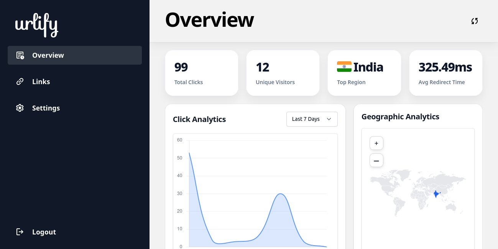
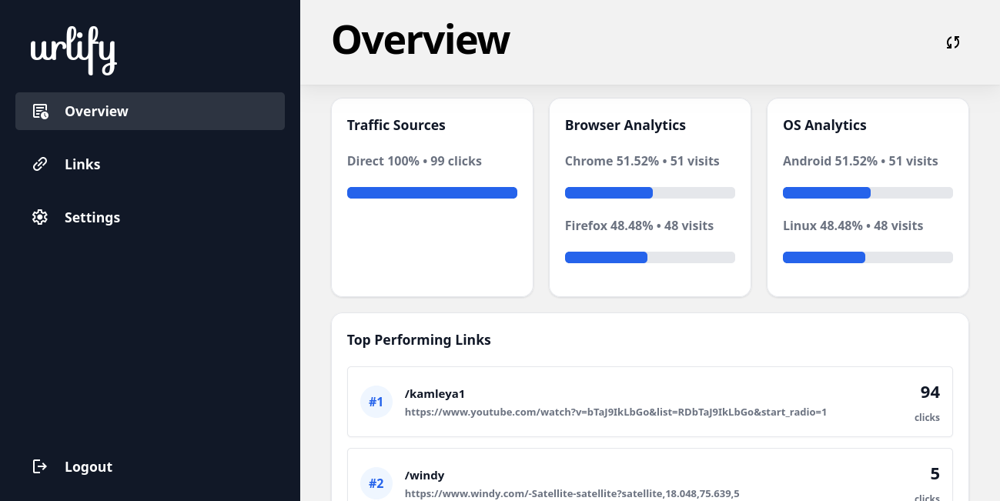
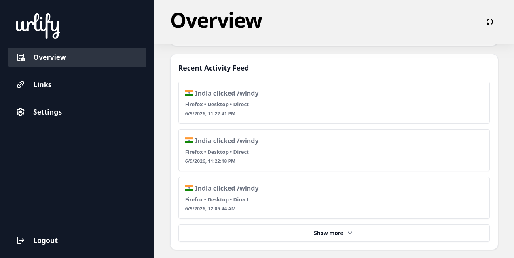
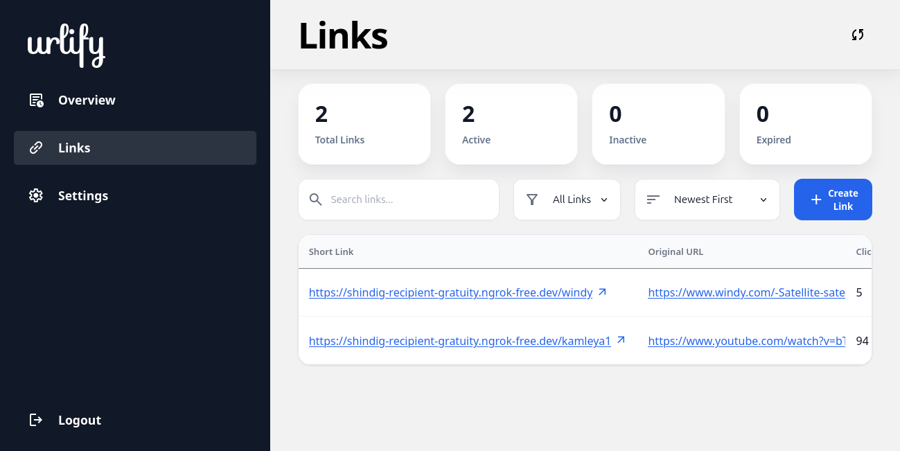
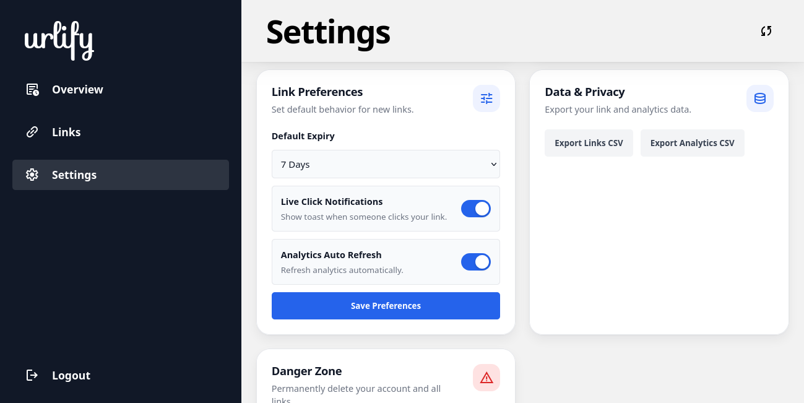
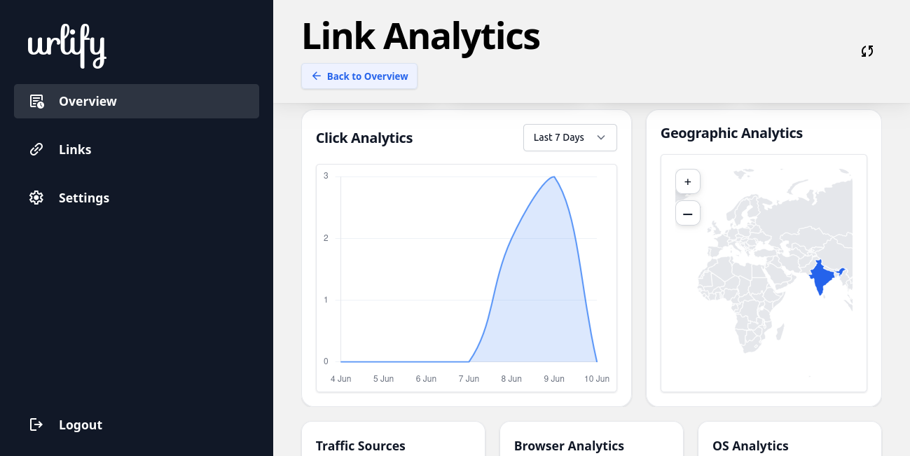
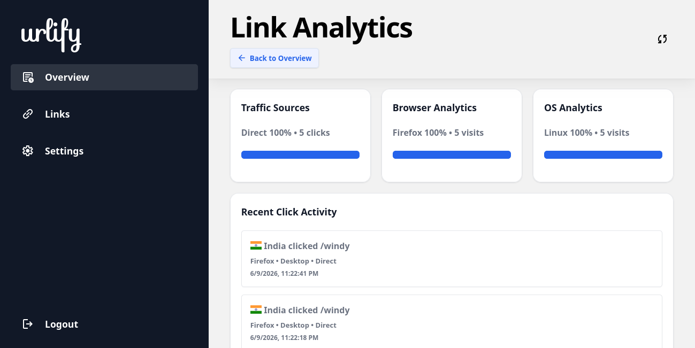
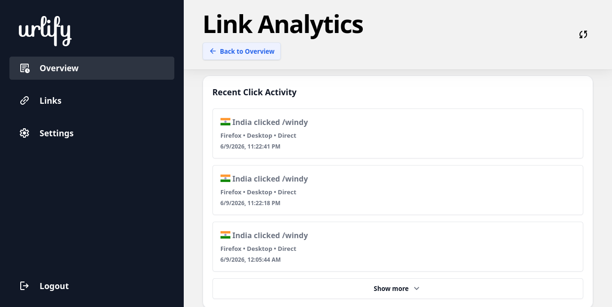
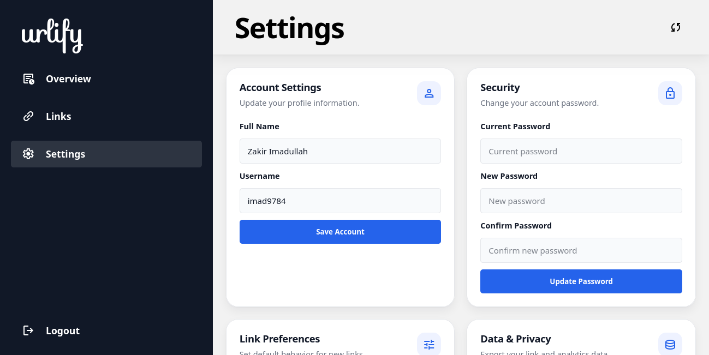
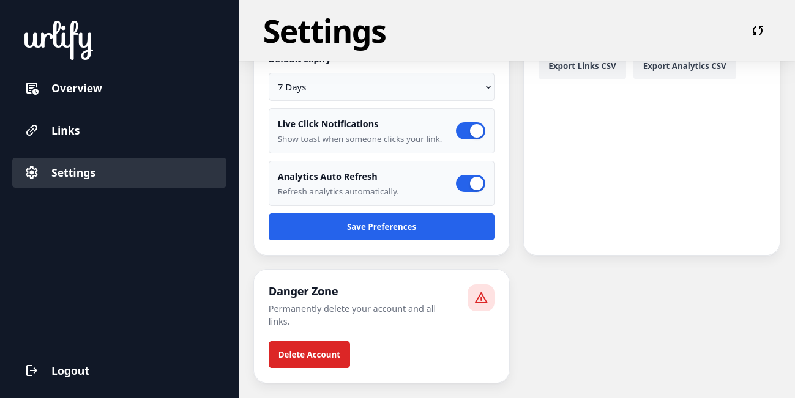

# URLify – Smart URL Shortener & Analytics Platform

A production-style URL shortener and analytics platform inspired by Bitly, built with performance, scalability, and real-time analytics in mind.

## Screenshots

### Dashboard Overview

Production-style analytics dashboard with real-time metrics, click tracking, geographic insights, browser analytics, and performance monitoring.

#### Overview – Metrics & Charts
Shows total clicks, unique visitors, redirect performance, click analytics, and geographic analytics.



#### Overview – Traffic & Performance Insights
Shows traffic sources, browser analytics, OS analytics, and top-performing links.



#### Overview – Recent Activity Feed
Shows real-time click activity with browser, device, region, and traffic source tracking.



---

### Link Management

Comprehensive link management with search, filtering, sorting, editing, QR generation, and link actions.

#### Links Dashboard
Shows searchable link management with filtering and analytics access.



#### Links Table View
Horizontal scrollable table for managing large link datasets.


---

### Individual Link Analytics

Detailed analytics for a specific shortened URL including click trends, geographic insights, and traffic breakdowns.

#### Link Analytics – Metrics Overview
Shows click statistics, visitors, redirect performance, and top region for a specific link.



#### Link Analytics – Charts & Geographic Insights
Shows click analytics graph and geographic analytics for an individual link.



#### Link Analytics – Traffic Breakdown
Shows browser analytics, OS analytics, and traffic source insights.



#### Link Analytics – Recent Click Activity
Shows recent click feed for a specific shortened URL.



---

### Settings & Preferences

User settings for account management, authentication, preferences, exports, and privacy.

#### Account & Security Settings
Manage profile details and password updates.



#### Preferences & Data Privacy
Configure link preferences, notifications, auto refresh, and exports.


#### Danger Zone
Secure account deletion and irreversible actions.



## Key Features

### Smart URL Management

* Custom short aliases
* URL expiration support
* Active/inactive link management
* QR code generation and download

### Real-Time Analytics

* Total clicks and unique visitors
* Browser, OS, and device analytics
* Region-based analytics
* Traffic source tracking
* Real-time click updates using WebSockets

### Performance Optimizations

* Redis caching for low-latency redirects
* Asynchronous analytics processing
* Optimized PostgreSQL queries
* Rate limiting to prevent abuse

### Security

* JWT cookie-based authentication
* Password hashing with bcrypt
* Protected routes and middleware


## Tech Stack

### Backend

* Node.js
* Express.js
* PostgreSQL (Neon)
* Redis (Upstash)
* WebSockets

### Frontend

* HTML
* CSS
* JavaScript
* Chart.js
* jsVectorMap

### Authentication & Security

* JWT
* bcrypt
* cookie-parser
* CORS

## Architecture

URLify follows a scalable backend architecture optimized for fast redirects, caching, and asynchronous analytics processing.

```text
                    User Request
                          ↓
                   Rate Limiter
                          ↓
                  URL Redirect API
                          ↓
                 Redis Cache Check
                    ↙           ↘
             Cache Hit        Cache Miss
                 ↓                 ↓
          Immediate Redirect   PostgreSQL Lookup
                 ↓                 ↓
             Async Analytics Logging
                          ↓
                     302 Redirect
```


### Request Flow

1. Incoming requests pass through rate limiting to prevent abuse.
2. Redis cache is checked for fast URL retrieval.
3. Cache hits redirect immediately with minimal latency.
4. Cache misses fetch data from PostgreSQL and refresh cache.
5. Click analytics are logged asynchronously to avoid blocking redirects.
6. Users are redirected using HTTP `302` responses.

## System Design Highlights

* Redis cache-aside pattern for fast redirects
* PostgreSQL as source of truth
* Async analytics logging to keep redirect path non-blocking
* Rate limiting on public redirect routes
* WebSocket-based live click notifications

## Engineering Decisions

### Why Redis?

Redis caching reduces redirect latency by avoiding repeated database lookups for frequently accessed links.

### Why asynchronous analytics?

Analytics logging runs asynchronously so redirects remain fast and user experience is not blocked.

### Why PostgreSQL?

PostgreSQL was chosen for reliable relational storage and analytics querying.

### Why JWT cookies?

JWT cookie authentication provides secure session handling and protected route access.


## Database Schema

URLify uses PostgreSQL to manage users, shortened URLs, analytics, and user preferences.

### Users

Stores user authentication and profile details.

| Field      | Type         | Description           |
| ---------- | ------------ | --------------------- |
| id         | SERIAL       | Primary key           |
| username   | VARCHAR(100) | Unique username       |
| fullname   | VARCHAR(150) | Full name             |
| password   | TEXT         | Hashed password       |
| created_at | TIMESTAMP    | Account creation time |

### URLs

Stores shortened URLs and metadata.

| Field        | Type        | Description              |
| ------------ | ----------- | ------------------------ |
| id           | SERIAL      | Primary key              |
| user_id      | INT         | Linked user              |
| original_url | TEXT        | Original destination URL |
| short_code   | VARCHAR(50) | Unique shortened code    |
| total_clicks | INT         | Number of redirects      |
| is_active    | BOOLEAN     | Active/inactive status   |
| expires_at   | TIMESTAMPTZ | Link expiration          |
| created_at   | TIMESTAMPTZ | Creation timestamp       |
| updated_at   | TIMESTAMPTZ | Last updated             |

### Click Analytics

Tracks redirect analytics and visitor behavior.

| Field            | Type          | Description      |
| ---------------- | ------------- | ---------------- |
| id               | SERIAL        | Primary key      |
| url_id           | INT           | Linked URL       |
| clicked_at       | TIMESTAMP     | Click timestamp  |
| ip_address       | TEXT          | Visitor IP       |
| user_agent       | TEXT          | Raw user agent   |
| device_type      | VARCHAR(50)   | Device type      |
| browser          | VARCHAR(50)   | Browser name     |
| operating_system | VARCHAR(50)   | Operating system |
| country          | VARCHAR(100)  | Visitor region   |
| referer          | TEXT          | Traffic referer  |
| traffic_source   | VARCHAR(50)   | Traffic category |
| redirect_time_ms | NUMERIC(10,2) | Redirect latency |

### User Settings

Stores user preferences and analytics settings.

| Field                  | Type        | Description              |
| ---------------------- | ----------- | ------------------------ |
| user_id                | INT         | Linked user              |
| default_expiry         | VARCHAR(30) | Default link expiry      |
| live_notifications     | BOOLEAN     | Live click notifications |
| analytics_auto_refresh | BOOLEAN     | Dashboard auto refresh   |
| created_at             | TIMESTAMPTZ | Created time             |
| updated_at             | TIMESTAMPTZ | Updated time             |


## Performance

### Redirect Optimization

* Reduced average redirect latency from ~300ms to ~70ms using Redis caching
* Measured server-side lifecycle timings (`redisMs`, `dbMs`, `redirectTimeMs`)
* Implemented asynchronous analytics logging to keep redirects non-blocking
* Cache-first redirect architecture for frequently accessed links

## Scalability Considerations

* Redis cache layer reduces database load for frequently accessed URLs
* PostgreSQL indexing for faster URL and analytics lookups
* Asynchronous analytics logging prevents redirect bottlenecks
* Rate limiting protects public redirect APIs from abuse
* Modular API structure for future microservice migration
  
## Challenges Faced

* Reduced redirect latency by separating analytics logging from the redirect path
* Implemented Redis cache fallback for database misses
* Prevented authentication redirect loops using protected route middleware
* Managed real-time dashboard updates with WebSockets
* Designed analytics queries for browser, OS, device, region, and traffic source breakdowns

## What I Learned

* Designing low-latency backend APIs
* Using Redis caching with PostgreSQL
* Building async analytics pipelines
* Handling authentication securely with JWT cookies
* Structuring analytics dashboards from raw event data

## API Endpoints

### Authentication

```http
POST /api/auth/signup
POST /api/auth/login
POST /api/auth/logout
```

### URL Management

```http
GET    /api/links
POST   /api/links
PATCH  /api/links/:id
DELETE /api/links/:id
GET    /:shortCode
```

### Analytics

```http
GET /api/analytics
GET /api/analytics/link/:linkId
```

### QR Code

```http
GET /api/qr
```

### Settings

```http
GET    /api/settings
PATCH  /api/settings/account
PATCH  /api/settings/password
PATCH  /api/settings/preferences
DELETE /api/settings/account
GET    /api/settings/export/links
GET    /api/settings/export/analytics
```

## Environment Variables

Create a `.env` file:

```env
DATABASE_URL=
JWT_SECRET=
REDIS_URL=
```

## Installation

```bash
git clone <repo-url>
cd urlify
npm install
npm start
```

## Future Improvements

* Team workspaces
* Advanced analytics filters
* Geo heatmaps
* Developer API Section
* 
## License

MIT
